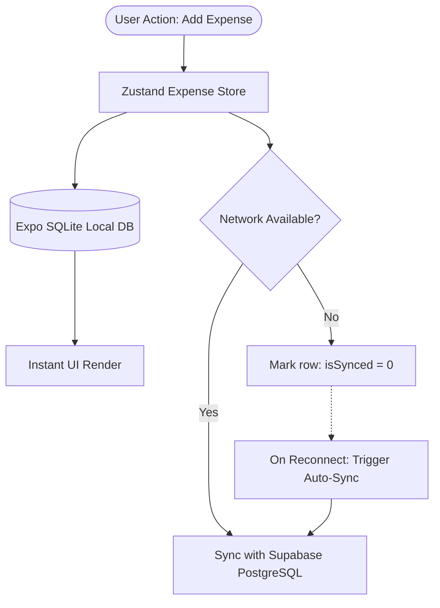
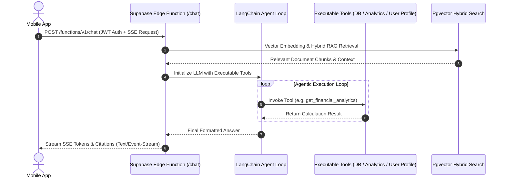

# 💳 Spendly — Smart Expense Tracking & Financial AI Assistant

<p align="center">
  
</p>

<p align="center">
  <strong>A premium, intelligent, offline-first mobile financial manager powered by React Native, Supabase, Google Gemini 2.5 Flash, and LangChain AI Agents.</strong>
</p>

<p align="center">
  <a href="https://expo.dev"></a>
  <a href="https://reactnative.dev"></a>
  <a href="https://supabase.com"></a>
  <a href="https://www.typescriptlang.org"></a>
  <a href="https://nodejs.org"></a>
  <a href="https://github.com/pmndrs/zustand"></a>
  <a href="https://ai.google.dev"></a>
  <a href="https://github.com/nkdasarnew/spendly/blob/main/LICENSE"></a>
</p>

<p align="center">
  <a href="https://apps.apple.com/app/spendly" target="_blank">
    
  </a>
  &nbsp;&nbsp;
  <a href="https://play.google.com/store/apps/details?id=com.nkdasarnew.spendly" target="_blank">
    
  </a>
</p>

---

## 📌 Table of Contents

- [✨ About \& Key Features](#-about--key-features)
  - [Core Value Proposition](#core-value-proposition)
  - [Categorized Feature List](#categorized-feature-list)
- [📂 Project Directory Structure](#-project-directory-structure)
- [🛠️ Tech Stack \& Prerequisites](#️-tech-stack--prerequisites)
  - [Technologies Used](#technologies-used)
  - [Developer Prerequisites](#developer-prerequisites)
- [🚀 Getting Started \& Local Setup](#-getting-started--local-setup)
  - [Step 1: Clone the Repository](#step-1-clone-the-repository)
  - [Step 2: Install Dependencies](#step-2-install-dependencies)
  - [Step 3: Supabase Backend Setup](#step-3-supabase-backend-setup)
  - [Step 4: Expo CLI \& Environment Configuration](#step-4-expo-cli--environment-configuration)
  - [Step 5: Run the Development App](#step-5-run-the-development-app)
- [📱 Building the App](#-building-the-app)
  - [Local Standalone Builds (Expo CLI / Xcode / Android Studio)](#local-standalone-builds-expo-cli--xcode--android-studio)
  - [Cloud Builds via Expo Application Services (EAS)](#cloud-builds-via-expo-application-services-eas)
- [🔒 Environment Variables Reference](#-environment-variables-reference)
- [💡 Key Features \& Codebase Architecture (Deep Dive)](#-key-features--codebase-architecture-deep-dive)
  - [1. Offline-First Caching \& Repository Pattern](#1-offline-first-caching--repository-pattern)
  - [2. LangChain RAG Agent \& Server-Sent Events (SSE)](#2-langchain-rag-agent--server-sent-events-sse)
  - [3. Multimodal Gemini 2.5 Flash OCR \& Payment Screenshot Scanner](#3-multimodal-gemini-2.5-flash-ocr--payment-screenshot-scanner)
  - [4. Global State Architecture (Zustand)](#4-global-state-architecture-zustand)
- [🏷️ Supported Spending Categories](#️-supported-spending-categories)
- [🤝 Contributing \& License](#-contributing--license)

---

## ✨ About & Key Features

### Core Value Proposition

**Spendly** is a state-of-the-art, cross-platform personal finance manager designed to eliminate manual expense logging friction. Combining **offline-first local SQLite caching** with **real-time cloud synchronization**, **multimodal AI vision (OCR)**, and an interactive **RAG AI Chatbot Agent**, Spendly empowers users to manage budgets, track transactions, import paper receipts or payment screenshots, and receive automated financial insights in real-time.

```
                  ┌──────────────────────────────────────────┐
                  │              Spendly Mobile              │
                  │   (React Native / Expo / TypeScript)     │
                  └────────────────────┬─────────────────────┘
                                       │
            ┌──────────────────────────┼──────────────────────────┐
            ▼                          ▼                          ▼
  ┌──────────────────┐       ┌──────────────────┐       ┌──────────────────┐
  │  Offline SQLite  │       │ Supabase Cloud   │       │ LangChain Agent  │
  │  Local DB Cache  │ ◄───► │ Auth & Postgres  │ ◄───► │ SSE Edge Chat    │
  └──────────────────┘       └──────────────────┘       └──────────────────┘
```

---

### Categorized Feature List

#### 🧾 Smart Expense Tracking & AI OCR
* 📷 **Gemini 2.5 Vision OCR**: Snap physical receipts; automatically extracts merchant, total amount, date, time, taxes, line items, and payment methods.
* 📱 **UPI Screenshot Auto-Parsing**: Instantly detects and parses Google Pay, PhonePe, and Paytm transaction confirmation screenshots.
* 🏷️ **Smart Categorization Engine**: Rule-based & regex heuristics instantly classify merchant names into 12 primary categories in milliseconds.

#### 📊 Budgeting & Analytics
* 📈 **Interactive Financial Charts**: Category break-downs and daily spending curves built with `react-native-gifted-charts`.
* 🎯 **Dynamic Budget Monitoring**: Set category monthly limits with real-time warning indicators when approaching or exceeding budgets.
* 💱 **Multi-Currency Engine**: Instant conversion across 150+ currencies with cached exchange rates.

#### 🤖 AI Financial Assistant (RAG Agent)
* 💬 **Real-time SSE Chatbot**: Ask questions about your spending habits, request category breakdowns, or update your profile via natural language.
* 🔧 **Executable Function Tools**: The agent executes real database updates, updates budgets, searches knowledge bases, and computes spending statistics using agentic tool calling.
* 🔍 **Hybrid RAG Vector Search**: Uses `pgvector` HNSW cosine similarity search combined with full-text keyword indexing to answer app usage questions with exact citation links.

#### ⚡ Offline-First Architecture & Cloud Sync
* 💾 **Local SQLite Storage**: Native SQLite database (`kiddo_expense.db`) guarantees instant application boots and full offline functionality.
* ☁️ **Supabase Sync**: Automatic background synchronization with PostgreSQL when connection is restored.
* 🔐 **Secure Authentication**: Email/Password authentication & native Google OAuth integration.

---

## 📂 Project Directory Structure

```text
spendly/
├── .env                              # Environment variable configuration (Ignored in Git)
├── .env.example                      # Template for required environment variables
├── app.json                          # Expo project metadata, bundle IDs, and plugins
├── eas.json                          # Expo Application Services (EAS) build & submit config
├── package.json                      # Project dependencies and script shortcuts
├── tsconfig.json                     # TypeScript compiler configuration
├── assets/                           # Application branding, fonts, icons, and preset images
│   ├── expo.icon                     # Native iOS icon
│   └── images/                       # App icons, splash screens, sample mock receipts
├── scripts/                          # Utility & project reset scripts
│   └── reset-project.js              # Script to reset project state
├── src/                              # Main application codebase
│   ├── global.css                    # Tailwind / Global CSS utility declarations
│   ├── app/                          # Expo Router file-based route definitions
│   │   ├── _layout.tsx               # Root layout, theme providers, & SQLite initialization
│   │   ├── (tabs)/                   # Navigation tab bar routes
│   │   │   ├── index.tsx             # Dashboard / Overview Screen
│   │   │   ├── analytics.tsx         # Analytics, charts, & report generation
│   │   │   ├── expenses.tsx          # All transactions listing
│   │   │   ├── ai.tsx                # AI Financial Assistant chat interface
│   │   │   └── settings.tsx          # Account settings & application preferences
│   │   ├── auth/                     # Authentication screens (Login, Signup, Reset Password)
│   │   ├── chat/                     # Full-screen RAG conversation details
│   │   └── modal/                    # Interactive modals (Add Expense, OCR Scan, Import Screenshot)
│   ├── components/                   # Modular, reusable UI components
│   │   ├── BotAvatar.tsx             # Animated AI Bot avatar widget
│   │   ├── Card.tsx                  # Standardized content card container
│   │   ├── CustomAlertModal.tsx      # System alert & confirmation modal
│   │   ├── EmptyState.tsx            # Styled placeholder for empty lists
│   │   ├── Header.tsx                # App header with notification badge
│   │   ├── NotificationSidebar.tsx   # Slide-out user notification drawer
│   │   ├── Skeleton.tsx              # Content loading placeholder animation
│   │   ├── SplashScreen.tsx          # Custom animated boot splash screen
│   │   ├── TransactionDetailModal.tsx# Detailed transaction inspector & editor
│   │   └── UserProfileModal.tsx      # Profile details modal
│   ├── database/                     # Offline SQLite persistence layer
│   │   ├── database.ts               # SQLite database initialization & schema seeding
│   │   └── repositories/             # Data access layer for CRUD operations
│   ├── hooks/                        # Custom React hooks
│   │   └── useTheme.ts               # Dynamic dark/light mode context hook
│   ├── lib/                          # External SDK initializers
│   │   └── supabase.ts               # Supabase JS client configuration with AsyncStorage
│   ├── screens/                      # Standalone screen implementations
│   │   └── TransactionsScreen.tsx    # Transaction manager with search & filters
│   ├── services/                     # Business logic and external API integrations
│   │   ├── aiService.ts              # Heuristic merchant category classifier
│   │   ├── auth.service.ts           # Supabase Auth & Google OAuth bridge
│   │   ├── budget.service.ts         # User budget quota manager
│   │   ├── chatService.ts            # SSE HTTP stream client for RAG Edge Function
│   │   ├── expense.service.ts        # Supabase cloud expense sync service
│   │   ├── exportService.ts          # CSV / JSON expense export generator
│   │   ├── notificationService.ts   # Push & local notification manager
│   │   ├── ocrService.ts             # Gemini 2.5 Flash multimodal vision receipt parser
│   │   └── storage.service.ts        # Supabase Storage receipt & avatar manager
│   ├── store/                        # Zustand global state stores
│   │   ├── alertStore.ts             # Global notification toast state
│   │   ├── authStore.ts              # Session & user metadata state
│   │   ├── chatStore.ts              # Conversation history & active messages state
│   │   ├── currencyStore.ts          # Currency selection & conversion rates
│   │   ├── expenseStore.ts           # Transactions, filter state, & sync status
│   │   ├── notificationStore.ts      # User activity alerts state
│   │   └── settingsStore.ts          # User preferences & theme settings
│   ├── types/                        # Global TypeScript interfaces & types
│   │   └── index.ts                  # Core data definitions (Expense, Category, Budget, User)
│   └── utils/                        # Formatting & utility functions
│       ├── expenseHelpers.ts         # Currency formatting & date manipulation helpers
│       ├── networkUtils.ts           # Internet connectivity monitoring helper
│       └── suppressWarnings.ts       # React Native console warning filter
└── supabase/                         # Supabase backend configuration
    ├── config.toml                   # Local Supabase project configuration
    ├── functions/                    # Deno Edge Functions
    │   ├── _shared/                  # CORS, PDF parsers, Supabase clients, Embeddings
    │   └── chat/                     # LangChain RAG Financial Agent Edge Function
    └── migrations/                   # Database SQL migrations & RLS policies
        └── 20260803000000_rag_chatbot.sql # Vector search schema, tables, storage & policies
```

---

## 🛠️ Tech Stack & Prerequisites

### Technologies Used

* **Mobile Core**: [React Native 0.81.5](https://reactnative.dev/), [Expo SDK 54](https://expo.dev/), [Expo Router 6](https://docs.expo.dev/router/introduction/)
* **Languages**: [TypeScript 5.9](https://www.typescriptlang.org/), SQL (PL/pgSQL), JavaScript (ESNext)
* **Backend as a Service**: [Supabase](https://supabase.com/) (PostgreSQL, Auth, Storage, Edge Functions)
* **Local Persistence**: [Expo SQLite 16](https://docs.expo.dev/versions/latest/sdk/sqlite/), [@react-native-async-storage/async-storage](https://react-native-async-storage.github.io/async-storage/)
* **State Management**: [Zustand 5.0](https://github.com/pmndrs/zustand)
* **Artificial Intelligence**: [Google Gemini 2.5 Flash API](https://ai.google.dev/) (Multimodal OCR), [LangChain](https://js.langchain.com/) (Agentic Execution), [Groq / OpenAI API](https://groq.com/)
* **Data Visualization**: [React Native Gifted Charts](https://github.com/Abhinandan-Kushwaha/react-native-gifted-charts)
* **Styling & UI**: Vanilla CSS / React Native StyleSheet, [Lucide React Native Icons](https://lucide.dev/), [React Native Reanimated 4](https://docs.swmansion.com/react-native-reanimated/)

---

### Developer Prerequisites

Ensure the following tools are installed on your system before proceeding:

1. **Node.js**: `v22.14.0` or higher (Recommended: install via [nvm](https://github.com/nvm-sh/nvm))
2. **Package Manager**: `npm` (v10+) or `pnpm`
3. **Expo CLI**: Installed globally (`npm install -g expo-cli`) or executed via `npx`
4. **Supabase CLI**: Required for database migrations and edge function deployment (`npm install -g supabase` or `brew install supabase/tap/supabase`)
5. **Git**: Installed for codebase version control
6. **Testing Client**:
   - Physical device with **Expo Go** installed (iOS App Store / Google Play Store), OR
   - **iOS Simulator** (macOS with Xcode installed), OR
   - **Android Emulator** (Android Studio with Virtual Device configured)

---

## 🚀 Getting Started & Local Setup

Follow these step-by-step instructions to get a local development instance of Spendly up and running.

### Step 1: Clone the Repository

```bash
git clone https://github.com/nkdasarnew/spendly.git
cd spendly
```

---

### Step 2: Install Dependencies

Install all node dependencies configured in `package.json`:

```bash
npm install
```

---

### Step 3: Supabase Backend Setup

#### 1. Link or Initialize Supabase Project
You can either link to an existing Supabase cloud project or run Supabase locally via Docker.

**Option A: Cloud Supabase Project (Recommended)**
```bash
# Login to Supabase CLI
supabase login

# Link your local repository to your Supabase project ref
supabase link --project-ref <your-supabase-project-ref>
```

**Option B: Local Supabase Instance**
```bash
supabase start
```

#### 2. Push Database Migrations
Deploy the required database schema, vector extensions (`pgvector`), RAG tables, hybrid search SQL functions, storage bucket configurations, and RLS security policies:

```bash
supabase db push
```

If setting up a fresh remote database, you can also execute the migration SQL script directly in the Supabase SQL Editor:
📄 File Location: [20260803000000_rag_chatbot.sql](file:///c:/Users/Nikhil/Downloads/Kiddo/expense/supabase/migrations/20260803000000_rag_chatbot.sql)

#### 3. Storage Setup & Security Policies (RLS)
The app relies on three Supabase storage buckets: `receipts`, `profile-pics`, and `documents`. Ensure these are created with Row Level Security enabled.

Execute the following SQL in your Supabase SQL Editor:

```sql
-- 1. Create Receipts Bucket
INSERT INTO storage.buckets (id, name, public, file_size_limit, allowed_mime_types)
VALUES ('receipts', 'receipts', true, 10485760, ARRAY['image/jpeg', 'image/png', 'image/webp'])
ON CONFLICT (id) DO NOTHING;

-- 2. Create Profile Pics Bucket
INSERT INTO storage.buckets (id, name, public, file_size_limit, allowed_mime_types)
VALUES ('profile-pics', 'profile-pics', true, 5242880, ARRAY['image/jpeg', 'image/png'])
ON CONFLICT (id) DO NOTHING;

-- 3. Create Documents Bucket
INSERT INTO storage.buckets (id, name, public, file_size_limit, allowed_mime_types)
VALUES ('documents', 'documents', false, 52428800, ARRAY['application/pdf', 'text/plain', 'text/markdown', 'text/csv'])
ON CONFLICT (id) DO NOTHING;

-- 4. Enable RLS on storage.objects
ALTER TABLE storage.objects ENABLE ROW LEVEL SECURITY;

-- 5. Storage RLS Policies for Receipts
CREATE POLICY "Allow users to upload receipts"
ON storage.objects FOR INSERT TO authenticated
WITH CHECK (bucket_id = 'receipts' AND (storage.foldername(name))[1] = auth.uid()::text);

CREATE POLICY "Allow users to read receipts"
ON storage.objects FOR SELECT TO authenticated
USING (bucket_id = 'receipts');

CREATE POLICY "Allow users to delete receipts"
ON storage.objects FOR DELETE TO authenticated
USING (bucket_id = 'receipts' AND (storage.foldername(name))[1] = auth.uid()::text);

-- 6. Storage RLS Policies for Profile Pics
CREATE POLICY "Allow users to upload profile pics"
ON storage.objects FOR INSERT TO authenticated
WITH CHECK (bucket_id = 'profile-pics' AND (storage.foldername(name))[1] = auth.uid()::text);

CREATE POLICY "Allow public reading of profile pics"
ON storage.objects FOR SELECT TO public
USING (bucket_id = 'profile-pics');
```

#### 4. Configure Supabase Dashboard Secrets
Set secrets required by Deno Edge Functions in your Supabase project secrets store:

```bash
supabase secrets set GEMINI_API_KEY="your-google-gemini-api-key"
supabase secrets set GROQ_API_KEY="your-groq-api-key"
```

#### 5. Deploy Edge Functions
Deploy the `chat` Edge Function which powers the AI Financial Agent:

```bash
supabase functions deploy chat --no-verify-jwt
```

---

### Step 4: Expo CLI & Environment Configuration

1. **Terminal Expo Authentication**:
   ```bash
   npx expo login
   ```

2. **Environment File Configuration**:
   Create a `.env` file in the root directory by copying `.env.example`:
   ```bash
   cp .env.example .env
   ```

3. Populate `.env` with your active keys:
   ```env
   EXPO_PUBLIC_GEMINI_API_KEY=your_gemini_api_key_here
   GROQ_API_KEY=your_groq_api_key_here

   EXPO_PUBLIC_SUPABASE_URL=https://your-project-id.supabase.co
   EXPO_PUBLIC_SUPABASE_ANON_KEY=your_supabase_anon_key_here

   EXPO_PUBLIC_GOOGLE_WEB_CLIENT_ID=your_google_web_client_id
   EXPO_PUBLIC_GOOGLE_ANDROID_CLIENT_ID=your_google_android_client_id
   ```

---

### Step 5: Run the Development App

Start the Expo Metro bundler:

```bash
npx expo start
```

#### Terminal Shortcuts:
* Press <kbd>a</kbd> to open in an **Android Emulator**.
* Press <kbd>i</kbd> to open in an **iOS Simulator**.
* Press <kbd>w</kbd> to open in a **Web Browser**.
* Press <kbd>r</kbd> to reload the Metro bundler.
* Scan the displayed **QR Code** using the **Expo Go** application on your physical iOS or Android device.

---

## 📱 Building the App

Spendly can be built as a standalone binary (`.apk`, `.aab`, `.ipa`) locally or using Expo Application Services (EAS).

### Local Standalone Builds (Expo CLI / Xcode / Android Studio)

#### 1. Android Local APK / Bundle Build
Generate native android project files and build locally:

```bash
# Generate native /android folder
npx expo prebuild --platform android

# Build standalone APK using Gradle
cd android
./gradlew assembleRelease
```
> The output `.apk` file will be generated in `android/app/build/outputs/apk/release/app-release.apk`.

#### 2. iOS Local IPA Build (macOS Required)
```bash
# Generate native /ios folder
npx expo prebuild --platform ios

# Open in Xcode
open ios/Spendly.xcworkspace
```
> Build and archive the application using Xcode to create an `.ipa` file or deploy directly to TestFlight.

---

### Cloud Builds via Expo Application Services (EAS)

Spendly is pre-configured with `eas.json` for cloud builds.

#### 1. Install EAS CLI & Login
```bash
npm install -g eas-cli
eas login
```

#### 2. Configure Project ID
Ensure `app.json` contains your Expo Project ID:
```json
{
  "extra": {
    "eas": {
      "projectId": "6dd49656-4b3c-41d9-8658-c4e12be818a5"
    }
  }
}
```

#### 3. Run Cloud Builds

* **Build Android APK (Preview)**:
  ```bash
  eas build --platform android --profile preview
  ```

* **Build Android Production App Bundle (.aab)**:
  ```bash
  eas build --platform android --profile production
  ```

* **Build iOS IPA (Production / TestFlight)**:
  ```bash
  eas build --platform ios --profile production
  ```

* **Submit Production Build to Stores**:
  ```bash
  eas submit --platform android
  eas submit --platform ios
  ```

---

## 🔒 Environment Variables Reference

| Variable Name | Required | Category | Description | Example / Format |
| :--- | :---: | :---: | :--- | :--- |
| `EXPO_PUBLIC_GEMINI_API_KEY` | **Yes** | Client AI | Google Gemini API Key used for client-side receipt OCR extraction. | `AIzaSyD...` |
| `GROQ_API_KEY` | **Yes** | Server AI | Groq API Key used by Supabase Edge Function to run high-speed LLM agent inferences. | `gsk_Bpp...` |
| `EXPO_PUBLIC_SUPABASE_URL` | **Yes** | Database | Your Supabase project HTTPS URL endpoint. | `https://xyz.supabase.co` |
| `EXPO_PUBLIC_SUPABASE_ANON_KEY` | **Yes** | Database | Supabase anonymous API public key for database & auth interactions. | `eyJhbGci...` |
| `EXPO_PUBLIC_GOOGLE_WEB_CLIENT_ID` | Optional | Auth | Web Client ID configured in Google Cloud Console for OAuth authentication. | `11313...apps.googleusercontent.com` |
| `EXPO_PUBLIC_GOOGLE_ANDROID_CLIENT_ID` | Optional | Auth | Android Client ID configured in Google Cloud Console for native Android OAuth. | `11313...apps.googleusercontent.com` |

---

## 💡 Key Features & Codebase Architecture (Deep Dive)

### 1. Offline-First Caching & Repository Pattern

Spendly implements a **local-first repository design pattern**. The application does not rely on an active network connection to display data or perform write operations.



* **Local Storage**: Built on `expo-sqlite` (`kiddo_expense.db`).
* **Web Fallback**: Web builds automatically fall back to an isolated `localStorage` mock database layer.
* **Sync Engine**: Each record contains an `isSynced` flag. Writes are committed locally first, followed by an asynchronous sync to Supabase `public.expenses`.

---

### 2. LangChain RAG Agent & Server-Sent Events (SSE)

The AI Financial Assistant (`/supabase/functions/chat`) is a Deno-based Deno/TypeScript Edge Function powered by **LangChain**, **Groq LLM models**, and **Supabase Vector Search**.



#### Key Capabilities of the AI Agent:
* **Tool Calling**: Equipped with 8+ executable tools:
  - `update_user_profile`: Dynamically updates user name, income, preferred currency, and preferences.
  - `update_transaction`: Modifies category, merchant, amount, or dates of existing expenses via chat.
  - `search_transactions`: Runs complex search queries across user transactions.
  - `get_financial_analytics`: Computes total spending, category breakdowns, savings rates, and income vs expense ratios.
  - `search_knowledge_base`: Queries app manuals using `pgvector` HNSW vector similarity search.
  - `update_budget` / `get_budgets`: Reads and modifies category monthly limits.
* **Real-time SSE Streaming**: Emits token chunks using `XMLHttpRequest` event streaming for instant UI feedback without waiting for full response generation.

---

### 3. Multimodal Gemini 2.5 Flash OCR & Payment Screenshot Scanner

Receipt processing is handled by `ocrService.ts` via the **Google Gemini 2.5 Flash API**, using Structured JSON Schemas (`responseSchema`).

```
  ┌────────────────────────┐      ┌─────────────────────────┐      ┌────────────────────────┐
  │ Physical Paper Receipt │  OR  │ Payment Screenshot      │  ───►│ Expo Image Manipulator │
  │ (Photo Capture)        │      │ (GPay / PhonePe / Paytm)│      │ (Resizes to 1000px)    │
  └────────────────────────┘      └─────────────────────────┘      └───────────┬────────────┘
                                                                               │
  ┌────────────────────────┐      ┌─────────────────────────┐                  │
  │ Parsed Expense Object  │◄─────│ Gemini 2.5 Flash API    │◄─────────────────┘
  │ (Merchant, Total, Tax, │      │ Structured JSON Schema  │  (Base64 Payload)
  │ Date, Line Items)      │      │ Response                │
  └────────────────────────┘      └─────────────────────────┘
```

#### OCR Features:
* **Automatic Native Compression**: Compresses photos natively using `expo-image-manipulator` prior to network transmission to save bandwidth.
* **Structured Output Guarantee**: Guarantees deterministic parsing into `merchant`, `amount`, `date`, `time`, `tax`, `currency`, `paymentMethod`, and `items`.
* **UPI Screenshot Detection**: Detects UPI transaction IDs and sets `isScreenshot = true` for mobile payment screenshots.

---

### 4. Global State Architecture (Zustand)

Spendly avoids prop-drilling by managing state via clean, decoupled **Zustand** stores:

```
                          ┌───────────────────────────┐
                          │   Zustand Global Stores   │
                          └─────────────┬─────────────┘
                                        │
     ┌──────────────────┬───────────────┼───────────────┬──────────────────┐
     ▼                  ▼               ▼               ▼                  ▼
┌─────────┐       ┌───────────┐   ┌───────────┐   ┌────────────┐    ┌─────────────┐
│ Auth    │       │ Expense   │   │ Chat      │   │ Currency   │    │ Settings    │
│ Store   │       │ Store     │   │ Store     │   │ Store      │    │ Store       │
└─────────┘       └───────────┘   └───────────┘   └────────────┘    └─────────────┘
```

* `useAuthStore`: Manages user authentication state, JWT sessions, and custom user metadata (budgets, preferences).
* `useExpenseStore`: Holds active transactions, search filter state, category stats, and offline sync progress.
* `useChatStore`: Manages active conversation sessions, streamed SSE message buffers, and citations.
* `useCurrencyStore`: Handles preferred display currency selection and live exchange rate conversions.

---

## 🏷️ Supported Spending Categories

Spendly automatically categorizes expenses into **12 primary financial categories**:

| Icon | Category | Example Merchants & Keywords |
| :---: | :--- | :--- |
| 🍕 | **Food** | Starbucks, McDonald's, Swiggy, Zomato, Burger King, Cafes, Restaurants |
| 🛒 | **Grocery** | Walmart, Target, Whole Foods, Blinkit, Zepto, Instamart, Supermarkets |
| ✈️ | **Travel** | Uber, Lyft, Ola, Airbnb, Flight tickets, IRCTC, Train/Bus fares |
| ⛽ | **Fuel** | Shell, Chevron, Exxon, Petrol Pumps, Diesel, Gas Stations |
| 🛍️ | **Shopping** | Amazon, Flipkart, Zara, H&M, Nike, Apparel stores, Online retail |
| 🎬 | **Entertainment** | Netflix, Spotify, Cinema, PlayStation, Steam, Movie tickets |
| 🔌 | **Bills** | Electricity, Internet, Mobile recharge, Water bill, Telecom invoices |
| 🏥 | **Health** | CVS, Walgreens, Doctor visits, Pharmacies, Gym memberships, Hospitals |
| 🏠 | **Rent** | Monthly house rent, Lease payments, Mortgages, Housing deposits |
| 💳 | **EMI** | Credit card bills, Loan installments, Personal loan repayments |
| 📚 | **Education** | Udemy, Coursera, College tuition fees, School expenses, Books |
| 📦 | **Other** | General fallback for uncategorized or miscellaneous expenses |

---

## 🤝 Contributing & License

### Contributing Guidelines

Contributions are welcome! Follow these steps to contribute to Spendly:

1. **Fork the Repository**: Click the "Fork" button at the top right of this repository.
2. **Create a Feature Branch**:
   ```bash
   git checkout -b feature/amazing-new-feature
   ```
3. **Commit your Changes**:
   ```bash
   git commit -m 'feat: add support for custom transaction tagging'
   ```
4. **Push to the Branch**:
   ```bash
   git push origin feature/amazing-new-feature
   ```
5. **Open a Pull Request**: Submit a Pull Request targeting the `main` branch.

---

### License

This project is licensed under the **MIT License**. See the [LICENSE](LICENSE) file for details.

```
MIT License

Copyright (c) 2026 Spendly Contributors

Permission is hereby granted, free of charge, to any person obtaining a copy
of this software and associated documentation files (the "Software"), to deal
in the Software without restriction, including without limitation the rights
to use, copy, modify, merge, publish, distribute, sublicense, and/or sell
copies of the Software, and to permit persons to whom the Software is
furnished to do so, subject to the following conditions:

The above copyright notice and this permission notice shall be included in all
copies or substantial portions of the Software.
```

---

<p align="center">
  Made with ❤️ by the <strong>Spendly Engineering Team</strong>
</p>
